# From Hoare to Hoare

I am interested in the history of computing and Rust programming language.
Here is a fascinating  rabbit hole I have fallen into.

- <https://graydon2.dreamwidth.org/318788.html>

- <https://youtu.be/wo84LFzx5nI>

- <https://archive.computerhistory.org/resources/text/Knuth_Don_X4100/PDF_index/k-9-pdf/k-9-u2293-Record-Handling-Hoare.pdf>


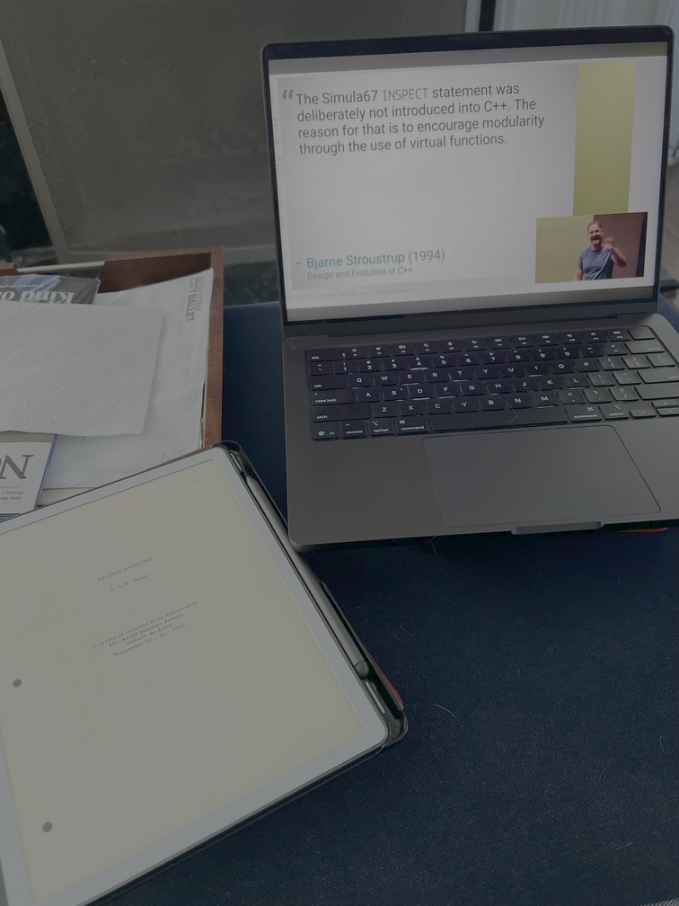
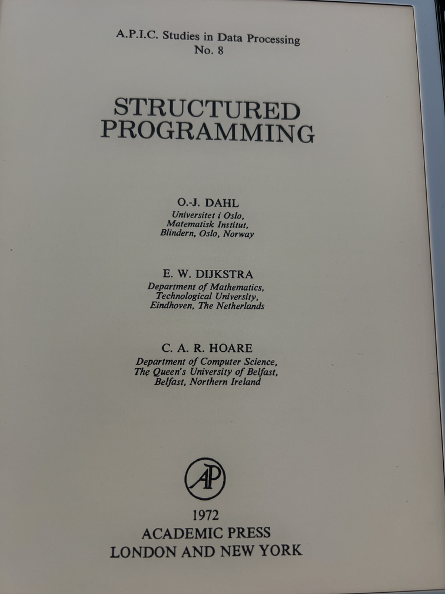
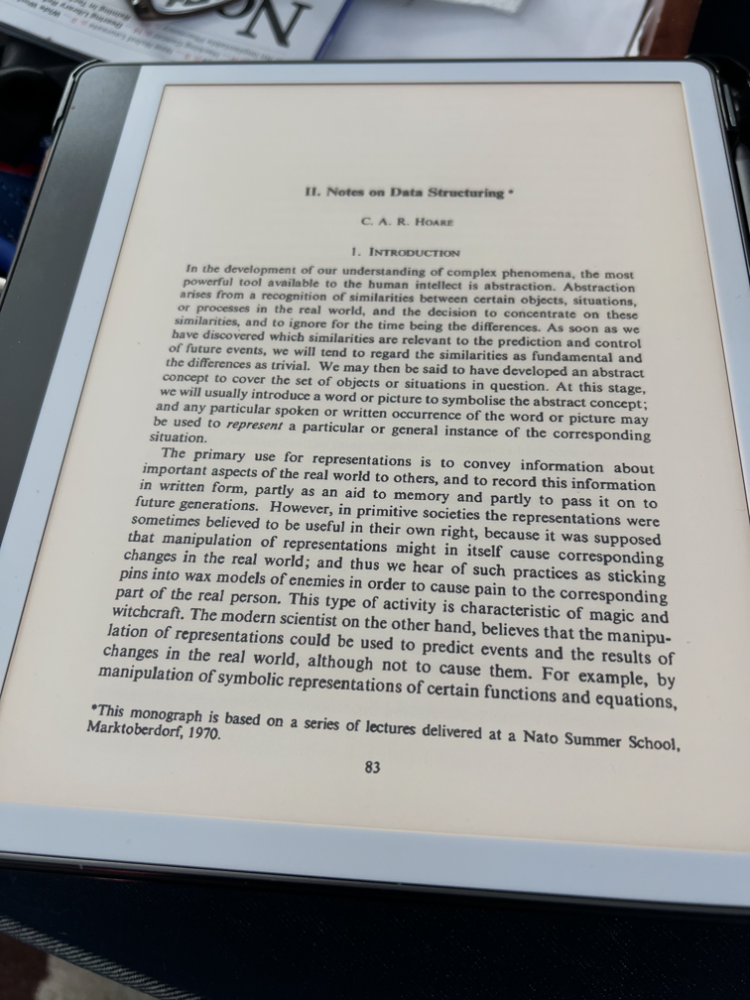
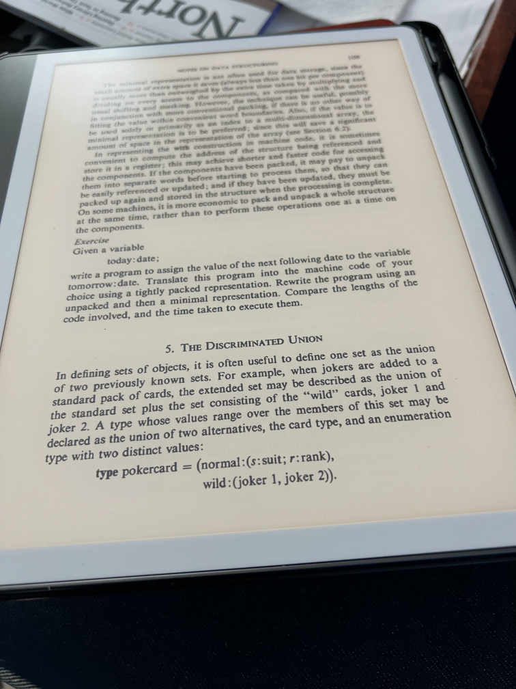
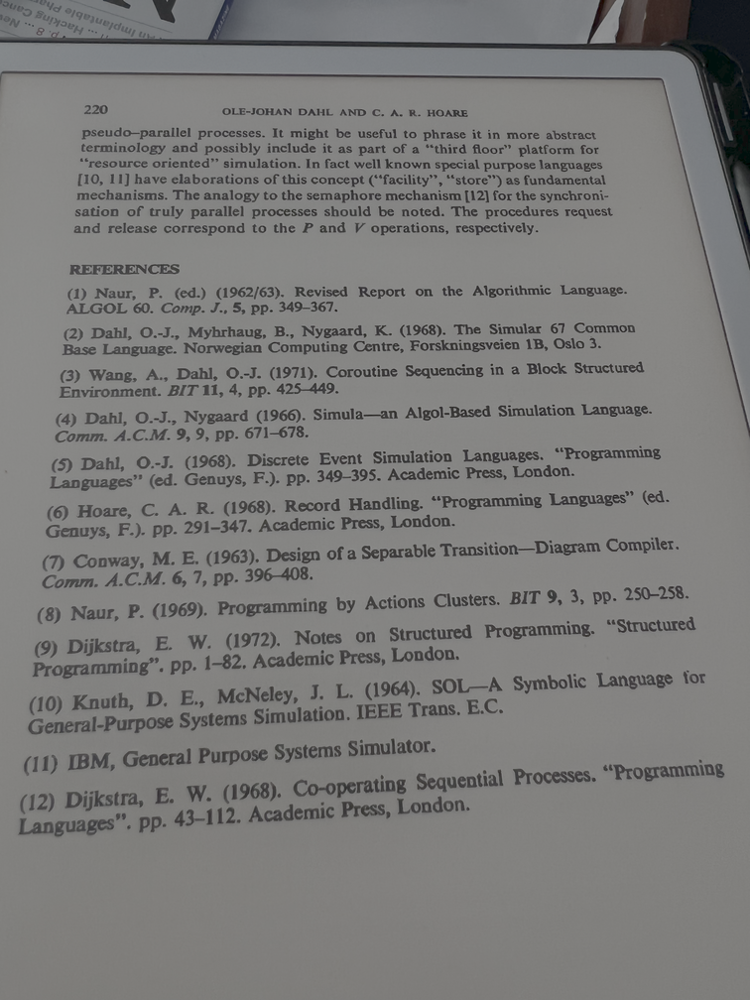
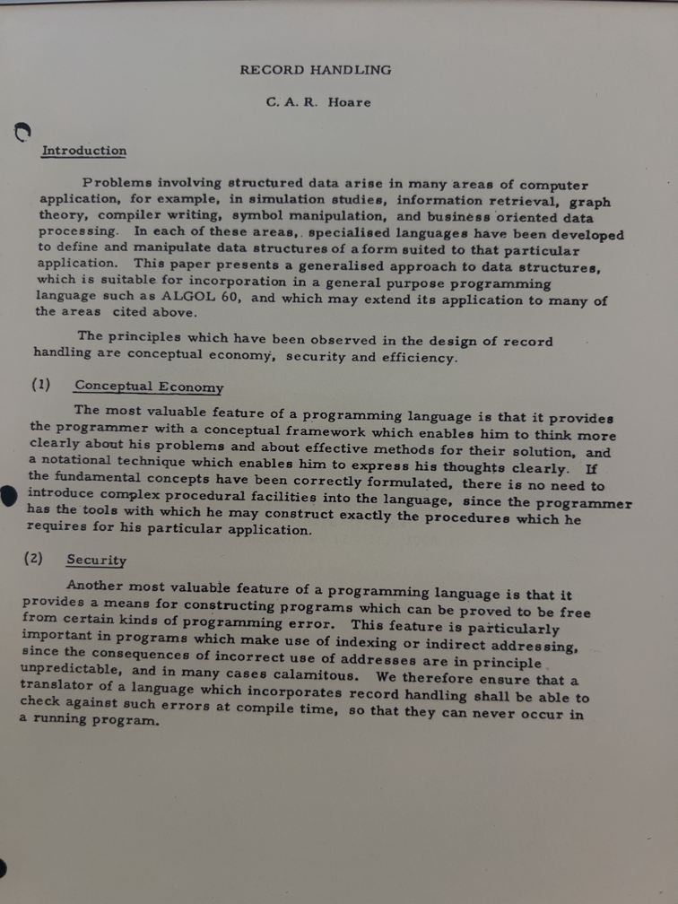
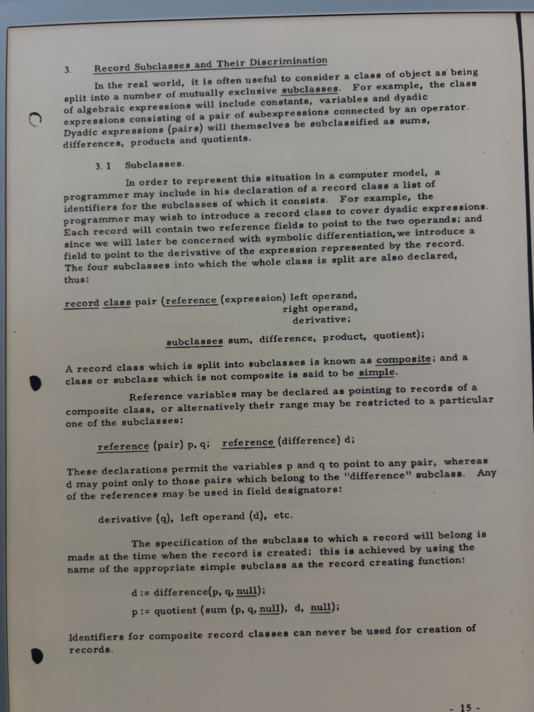
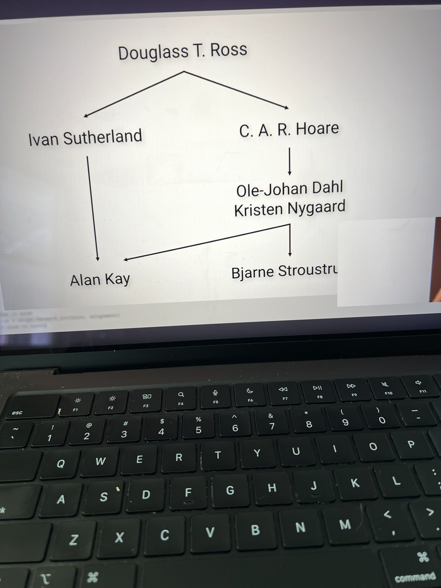

Now I can disappear into a rabbit hole with my Kindle Scribe. 🐇🕳️ 📚 🙇🏻‍♂️

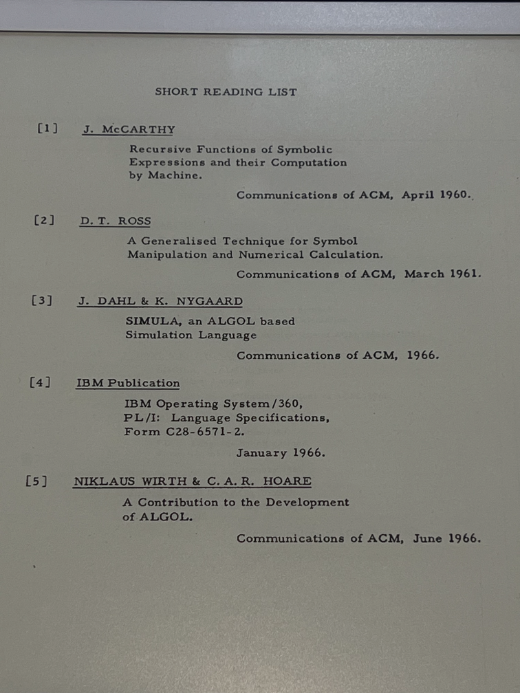
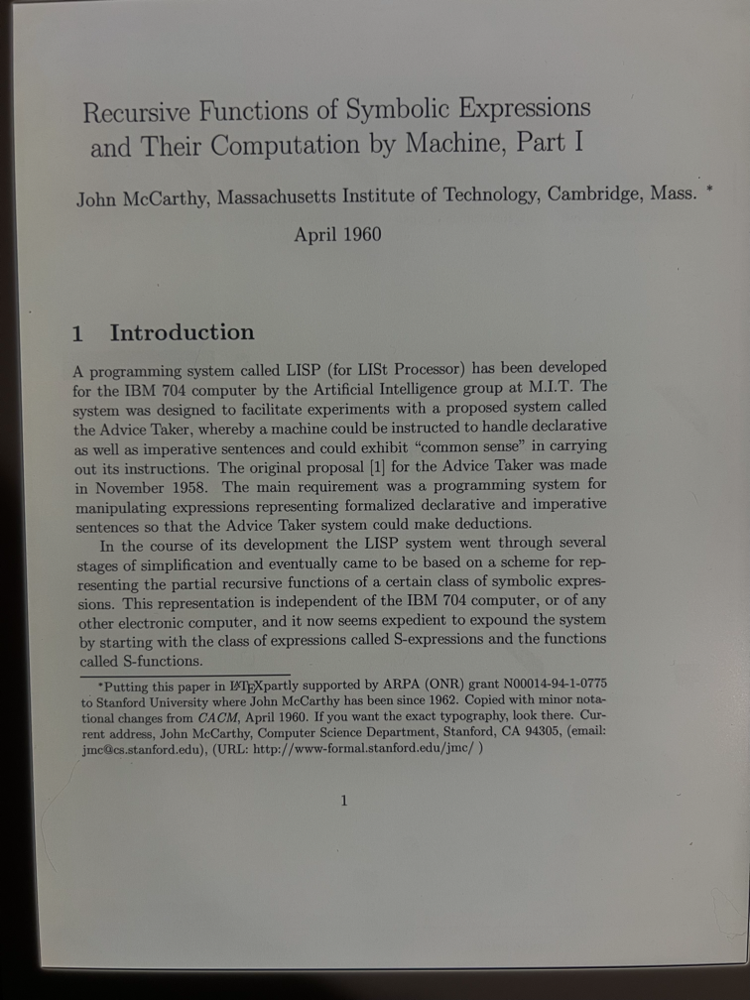
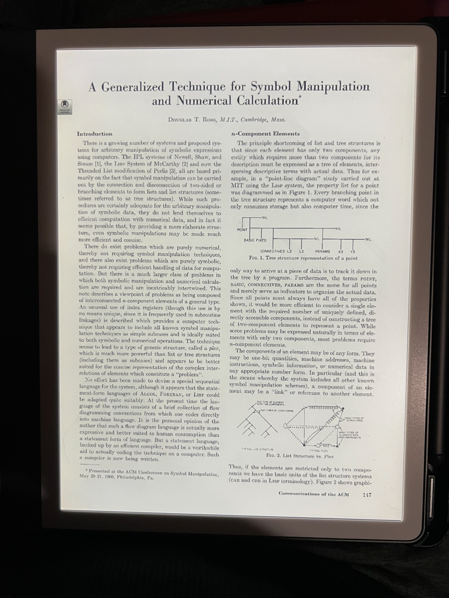
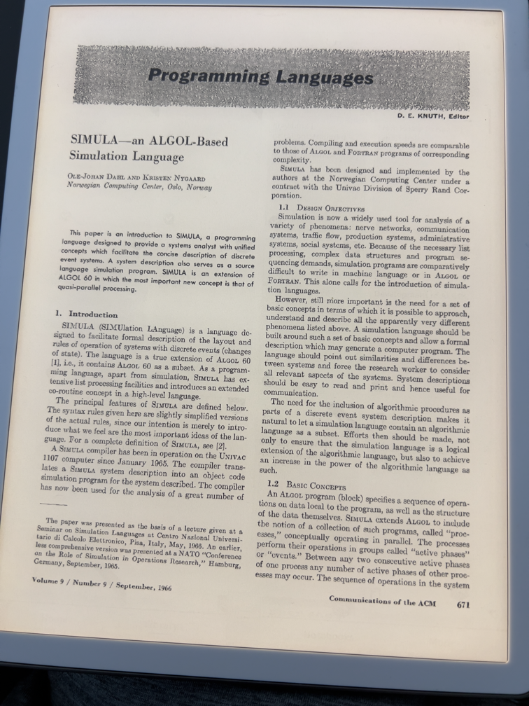
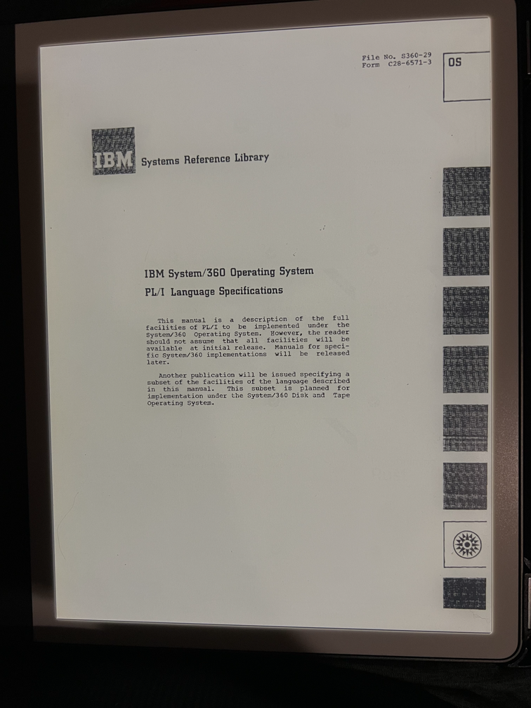
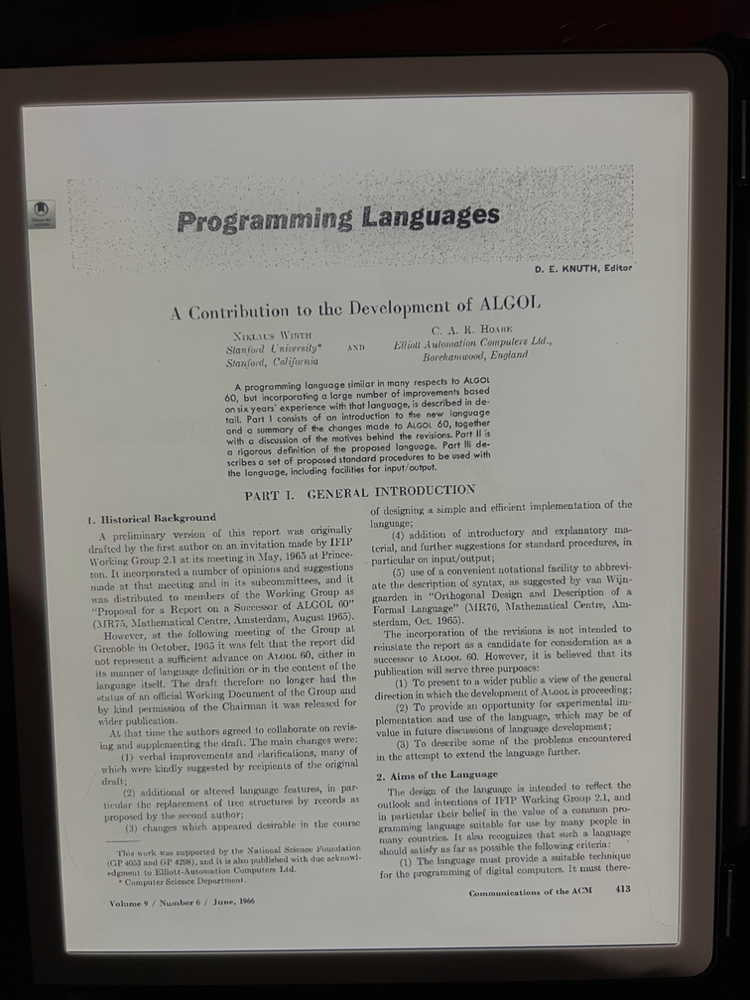


# The last rabbit hole

Since the pictures taken form iPhone are too big (see the `raw_png` folder), I wrote a quick rust program to 
resize them. It generated a 632M target folder which is gitignored. The total size of the local folder is 
approaching 1G.

```
% du -hsc *
 28K	Cargo.lock
4.0K	Cargo.toml
271M	raw_png
4.0K	README.md
 20M	resized_png
4.0K	src
632M	target
923M	total
```

