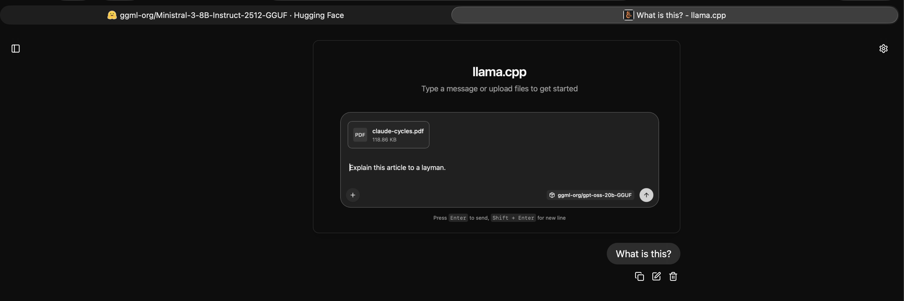
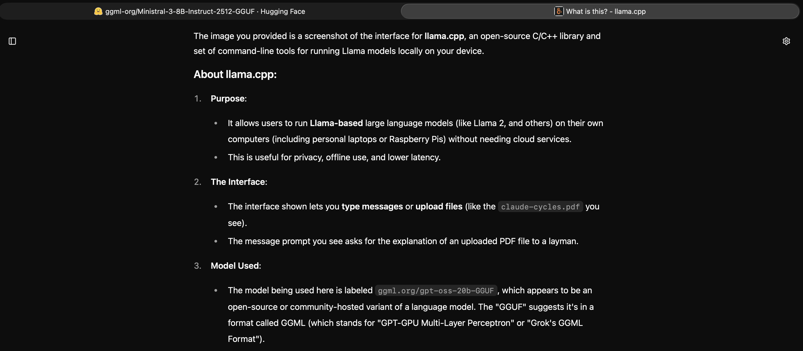
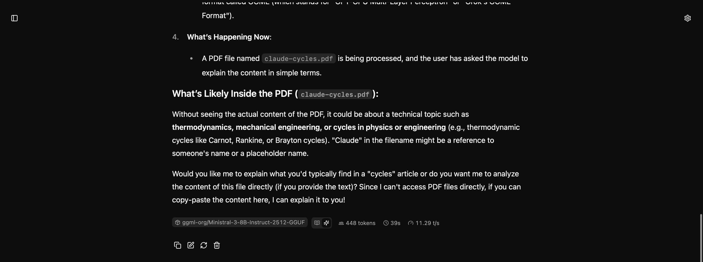

https://huggingface.co/ggml-org/Ministral-3-8B-Instruct-2512-GGUF

```
sam@Sams-MacBook-Pro rabbit-holes % make -C llama-cpp/models/Ministral-3-8B-Instruct-2512-GGUF/
../../ggml-org/llama.cpp/build/bin/llama-cli -hf ggml-org/Ministral-3-8B-Instruct-2512-GGUF 
ggml_metal_device_init: testing tensor API for f16 support
ggml_metal_library_compile_pipeline: compiling pipeline: base = 'dummy_kernel', name = 'dummy_kernel'
ggml_metal_library_compile_pipeline: loaded dummy_kernel                                  0x103c52880 | th_max = 1024 | th_width =   32
ggml_metal_device_init: testing tensor API for bfloat support
ggml_metal_library_compile_pipeline: compiling pipeline: base = 'dummy_kernel', name = 'dummy_kernel'
ggml_metal_library_compile_pipeline: loaded dummy_kernel                                  0x103c4fd00 | th_max = 1024 | th_width =   32
ggml_metal_library_init: using embedded metal library
ggml_metal_library_init: loaded in 0.017 sec
ggml_metal_rsets_init: creating a residency set collection (keep_alive = 180 s)
ggml_metal_device_init: GPU name:   MTL0
ggml_metal_device_init: GPU family: MTLGPUFamilyApple10  (1010)
ggml_metal_device_init: GPU family: MTLGPUFamilyCommon3 (3003)
ggml_metal_device_init: GPU family: MTLGPUFamilyMetal4  (5002)
ggml_metal_device_init: simdgroup reduction   = true
ggml_metal_device_init: simdgroup matrix mul. = true
ggml_metal_device_init: has unified memory    = true
ggml_metal_device_init: has bfloat            = true
ggml_metal_device_init: has tensor            = true
ggml_metal_device_init: use residency sets    = true
ggml_metal_device_init: use shared buffers    = true
ggml_metal_device_init: recommendedMaxWorkingSetSize  = 19069.67 MB
common_download_file_single_online: no previous model file found /Users/sam/Library/Caches/llama.cpp/ggml-org_Ministral-3-8B-Instruct-2512-GGUF_preset.ini
common_download_file_single_online: HEAD failed, status: 404
no remote preset found, skipping
common_download_file_single_online: using cached file (same etag): /Users/sam/Library/Caches/llama.cpp/ggml-org_Ministral-3-8B-Instruct-2512-GGUF_Ministral-3-8B-Instruct-2512-Q8_0.gguf
common_download_file_single_online: using cached file (same etag): /Users/sam/Library/Caches/llama.cpp/ggml-org_Ministral-3-8B-Instruct-2512-GGUF_mmproj-Ministral-3-8B-Instruct-2512-Q8_0.gguf

Loading model...  


▄▄ ▄▄
██ ██
██ ██  ▀▀█▄ ███▄███▄  ▀▀█▄    ▄████ ████▄ ████▄
██ ██ ▄█▀██ ██ ██ ██ ▄█▀██    ██    ██ ██ ██ ██
██ ██ ▀█▄██ ██ ██ ██ ▀█▄██ ██ ▀████ ████▀ ████▀
                                    ██    ██
                                    ▀▀    ▀▀

build      : b8193-ecd99d6a9
model      : ggml-org/Ministral-3-8B-Instruct-2512-GGUF
modalities : text, vision

available commands:
  /exit or Ctrl+C     stop or exit
  /regen              regenerate the last response
  /clear              clear the chat history
  /read               add a text file
  /image <file>       add an image file

```

> What is Ministral-3-8B-Instruct-2512-GGUF?

**Ministral-3-8B-Instruct-2512-GGUF** refers to a specific **quantized version** of the **Ministral-3-8B** language model, designed for efficient deployment and inference.

### Breakdown of the name:
1. **Ministral-3-8B**
   - A **large language model** developed by **Mistral AI** (a French AI lab).
   - **"8B"** indicates the model's size: ~8 billion parameters.
   - The **"3"** suggests it is part of the **third iteration** of their model family.

2. **`-Instruct`**
   - This variant is **fine-tuned for instruction-following** (better at understanding and generating responses to user prompts, like me!).

3. **`-GGUF`**
   - **GGUF** stands for **"GGML Quantized Model File Format"**, created by **Grok** (from xAI).
   - This format compresses large models (e.g., to **4-bit or 8-bit precision**) while preserving performance.
   - The **`-GGUF`** file can be loaded into lightweight AI tools (e.g., **OobaboogaText Generation WebUI**, **lmstudio**, or **text-generation-webui**).

4. **`-2512`**
   - Likely refers to the **date of release or version timestamp** (likely **December 25, 2023**).
   - This helps distinguish it from other releases (e.g., earlier/future versions).

---

### Key Features of `-GGUF` Quantized Models:
✅ **Smaller file size** (easier to store/share).
✅ **Faster loading & inference** (runs on consumer hardware like RTX GPUs or even CPUs).
✅ **Optimized for offline use** (no need for cloud APIs).

---
### How to Use It?
You’d typically download the `.gguf` file and use it with:
- **[OobaboogaTextGenerationWebUI](https://github.com/oobabooga/text-generation-webui)** (popular open-source LLM server).
- **[lmstudio](https://lmstudio.ai/)** (GUI for local LLM deployment).
- **[text-generation-webui](https://github.com/TheBloke/text-generation-webui)** (another WebUI option).

---
### Where to Find It?
Mistral AI may host official `.gguf` models, but they’re also often shared by:
- **[TheBloke’s GGUF Hub](https://huggingface.co/TheBloke/)** (common source for quantized models).
- **[Hugging Face](https://huggingface.co/MistralAI)** (official models, sometimes quantized by community members).

---
### Note on Accuracy:
Quantizing (e.g., to 4-bit) may slightly reduce performance compared to the full-precision model, but `-GGUF` variants are designed to retain most capabilities.

Would you like help finding the download link or setting it up?

[ Prompt: 198.8 t/s | Generation: 11.9 t/s ]

> /exit

```

Exiting...
llama_memory_breakdown_print: | memory breakdown [MiB] | total   free     self   model   context   compute    unaccounted |
llama_memory_breakdown_print: |   - MTL0 (Apple M5)    | 18186 =  119 + (17571 =  8603 +    8704 +     264) +         495 |
llama_memory_breakdown_print: |   - Host               |                   688 =   544 +       0 +     144                |
ggml_metal_free: deallocating
ggml_metal_free: deallocating
```








